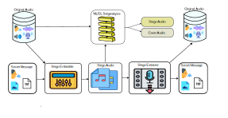

# Audio Steganography — Lossless LSB with PSR Defense Against CNN Steganalysis

**Paper:** Securing Lossless Audio Against AI-Driven Steganalysis
**Venue:** Multimedia Tools and Applications (MTAP), Springer (under review, R1)

## Table of Contents

1. [Overview](#1-overview)
2. [Key Features](#2-key-features)
3. [Directory Structure](#3-directory-structure)
4. [Installation](#4-installation)
5. [Data Preparation](#5-data-preparation)
6. [Usage: Steganography (main.py)](#6-usage-steganography-mainpy)
7. [Usage: Batch Benchmark (run_case_limited.py)](#7-usage-batch-benchmark-run_case_limitedpy)
8. [Usage: Steganalysis Training (train.py)](#8-usage-steganalysis-training-trainpy)
9. [Usage: Metrics Aggregation (metrics.py)](#9-usage-metrics-aggregation-metricspy)
10. [Reproducibility](#10-reproducibility)
11. [Citation](#11-citation)

## 1. Overview



- **Steganography** — embedding secret data (images, text, binary files) into lossless WAV audio using five LSB-based methods (M1–M5) and one frequency-domain baseline (Phase Coding).
- **Steganalysis** — training CNN / C-RNN detectors to evaluate the statistical detectability of each method across independent runs on MUSDB18-HQ and TIMIT.

The proposed method M5 combines adaptive-*k* LSB with PRNG-driven Fisher–Yates permutation and key-and-content-derived salt (SHA-256), targeting a favorable trade-off between imperceptibility and resistance to CNN-based steganalysis while maintaining fully lossless secret recovery.

## 2. Key Features

| ID | Algorithm | Domain | Description |
| :--- | :--- | :--- | :--- |
| M1 | Standard LSB | Spatial | Sequential 1-bit LSB replacement |
| M2 | Random LSB — Fixed *k*, Default Salt | Spatial | PRNG permutation, fixed *k*, static salt |
| M3 | Random LSB — Fixed *k*, Content Salt | Spatial | PRNG permutation, fixed *k*, SHA-256 content salt |
| M4 | Random LSB — Adaptive *k*, Default Salt | Spatial | PRNG permutation, adaptive *k* ∈ [1, 6], static salt |
| M5 | Random LSB — Adaptive *k*, Content Salt | Spatial | PRNG permutation, adaptive *k*, SHA-256 content salt (proposed) |
| PC | Phase Coding | Frequency | FFT-based phase manipulation |
| BL | Alarood et al. (2022) | Spatial | Randomized-LSB baseline from the literature |

**Highlights**

- **Security** — Key- and content-derived salt prevents sequential extraction and disrupts patterns exploitable by CNN-based steganalysis.
- **Lossless carrier** — Full byte-exact recovery of the secret payload; no lossy compression is applied to the audio carrier itself.
- **Matched physical payload** — Image payloads are pre-processed (resize + JPEG compression at a fixed quality) so that the *physical embedding rate* can be aligned with literature baselines for a fair, apples-to-apples distortion comparison.
- **Adaptive capacity** — *k* is computed automatically from payload size and available carrier samples (capacity-aware matching).
- **Reproducible evaluation** — GroupShuffleSplit (70/15/15) with fixed seeds and a deterministic test partition.

## 3. Directory Structure

```text
audio-steganograph/
├── main.py                  # CLI: single-file encode / decode
├── train.py                 # CLI: CNN steganalysis training
├── metrics.py                # CLI: aggregate mean/std from experiment_results.csv
├── helpers.py                # GUI file picker, session folder, CSV logger utilities
├── requirements.txt
├── workflow.svg
│
├── AudioStego/                # Core steganography modules & algorithms
│   ├── exp/                   # Batch experiment scripts
│   │   ├── benchmark_stego.py     # CLI: single-file benchmark
│   │   ├── run_case.py            # CLI: full-dataset batch benchmark
│   │   ├── run_case_limited.py    # CLI: capacity-aware dataset generation
│   │   ├── stego_core.py          # Core algorithms (M1–M5, Phase, Alarood)
│   │   └── logs/                  # Benchmark output logs
│   ├── improved_lsb/          # M2–M5 wrapper (PSR LSB)
│   ├── lsb/                   # M1 wrapper (Standard LSB)
│   ├── phasecoding/           # Phase Coding wrapper
│   ├── alarood/                # Alarood et al. (2022) baseline implementation
│   └── utils/                  # Visualization utilities
│
├── Steganalysis/               # Detection pipeline
│   ├── dataset.py               # Feature extraction + GroupShuffleSplit loader
│   ├── features.py              # Mel spectrogram (high-pass filtered) + MFCC features
│   ├── models.py                 # build_deep_model (CNN / C-RNN)
│   ├── trainer.py                # StegoTrainer: training loop, logging, plotting
│   ├── Data/                     # Extracted feature caches (not version-controlled)
│   └── logs/                     # Per-run training checkpoints and CSVs (not version-controlled)
│
├── inputs/                      # Datasets & sample files
│   ├── musdb-18/                 # MUSDB18-HQ music corpus
│   ├── random-image-coco/        # Image payloads (COCO)
│   └── audio-cat-and-dogs/       # Generalization test corpus
│
└── google_colab/                # Supplementary notebooks & traditional ML logs
    ├── logs_staganography/        # Notebooks for plotting steganography metrics
    └── logs_steganalysis/         # SVM, Random Forest, Logistic Regression pipelines
```

> **Note:** `Steganalysis/Data/` and `Steganalysis/logs/` contain large binary artifacts (`.npz` feature caches, `.keras` model checkpoints) generated locally during experimentation. These are excluded from version control via `.gitignore`; see [Section 8](#8-usage-steganalysis-training-trainpy) for how to regenerate them.

## 4. Installation

Requirements: Python 3.11+, CUDA 11.x+ (recommended for CNN training).

```bash
git clone https://github.com/nthai-cit/audio-steganograph.git
cd audio-steganograph
pip install -r requirements.txt
```

## 5. Data Preparation

Place the datasets into the `inputs/` directory according to the structure below:

```text
inputs/
├── musdb-18/             *.wav
├── random-image-coco/    *.jpg
└── audio-cat-and-dogs/   *.wav
```

> TIMIT source files are distributed in NIST SPHERE format, which is not directly readable by `scipy.io.wavfile` or `soundfile`. Convert to RIFF WAV (or filter by header) before use with the scripts in `AudioStego/exp/`.

## 6. Usage: Steganography (main.py)

`main.py` supports three actions: `encode`, `decode`, and `batch`. If `--input` or `--secret` are omitted, a GUI file-picker dialog opens automatically.

### Arguments

| Argument | Short | Action | Description | Default |
| :--- | :--- | :--- | :--- | :--- |
| `action` | — | All | Operation mode | `encode` / `decode` / `batch` |
| `--method` | `-m` | All | Algorithm | `lsb` / `phase` / `improved` |
| `--input` | `-i` | All | Cover WAV file or directory | GUI picker |
| `--secret` | `-s` | Encode / Batch | Secret file to hide | GUI picker |
| `-k` | — | Encode / Batch | Number of LSB bits (LSB / Improved only) | `None` (encode), `2` (batch) |
| `--password` | `-p` | All | Embedding password | `"default"` |

### Examples

```bash
# Encode an image into a WAV file (Improved LSB / M5)
python main.py encode -m improved -i "inputs/audio.wav" -s "inputs/img.jpg" -p "NgocChien"

# Decode and recover the secret
python main.py decode -m improved -i "outputs/encode/stego.wav" -p "NgocChien"
```

## 7. Usage: Batch Benchmark (run_case_limited.py)

Generates a paired cover/stego dataset at scale. The script is located in `AudioStego/exp/`.

```bash
python AudioStego/exp/run_case_limited.py \
    --case_id 5 \
    --input_dir   "inputs/musdb-18" \
    --output_base "outputs/dataset" \
    --secret_dir  "inputs/random-image-coco" \
    --max_files 750 \
    --limit 500 \
    --size 512 \
    --password "NgocChien"
```

### Case IDs

| ID | Name | Method |
| :--- | :--- | :--- |
| 1 | `1_NoRandom` | M1 — Sequential LSB |
| 2 | `2_Random_Fixed_DefaultSalt` | M2 |
| 3 | `3_Random_Fixed_ContentSalt` | M3 |
| 4 | `4_Random_Adaptive_DefaultSalt` | M4 |
| 5 | `5_Random_Adaptive_ContentSalt` | M5 (proposed) |
| 7 | `7_PhaseCoding` | Phase Coding |

## 8. Usage: Steganalysis Training (train.py)

`train.py` orchestrates independent training of CNN / C-RNN steganalysis detectors.

```bash
# Train a CNN detector on the M5 stego corpus
python train.py \
    --cover "outputs/dataset/5_Random_Adaptive_ContentSalt/cover" \
    --stego "outputs/dataset/5_Random_Adaptive_ContentSalt/stego" \
    --algo cnn --depth 5 --filters 64 \
    --epochs 50 --batch_size 64 --lr 0.0001 --runs 10
```

### Feature Extraction Details

- **Input:** fixed-length clip at native sample rate (length depends on the source corpus; see `Steganalysis/dataset.py`).
- **Secret payload:** images resized and JPEG-compressed at a fixed quality to align the physical embedding rate with the comparison baseline.
- **Pre-processing:** 10th-order Butterworth high-pass filter (cutoff 2000 Hz) to expose LSB-induced noise.
- **Representation:** Mel spectrogram, 128 mel bands × 216 time frames, log-power (dB), single channel.
- **Split protocol:** GroupShuffleSplit — 70% train / 15% validation / 15% test; test partition fixed at `random_state=42`.

## 9. Usage: Metrics Aggregation (metrics.py)

Reads all `experiment_results.csv` files produced by `train.py` and computes mean ± standard deviation across runs.

```bash
python metrics.py \
    --dir "Steganalysis/logs/Impro_LSB_CNN_image_100kb" \
    --filter "CNN_"
```

#### 10. Reproducibility
The pipeline is designed to be fully reproducible with the following fixed configuration and deposited artifacts:

| Item | Value / Location |
| ------ | ------ |
| **Track-ID Split** | Split protocol and reproduction logic provided in [corpus_split_protocol.txt](corpus_split_protocol.txt) |
| **Password** | Nguy....ien (Author's name) |
| **10-run seeds** | base_seeds = [42, 101, 202, 303, 404, 505, 606, 707, 808, 909] |
| **Test split seed** | 42 (fixed via GroupShuffleSplit) |
| **Train/Val split** | varies per run seed (see Steganalysis\dataset.py) |
| **Static salt (M2, M4)** | "STATIC_DEFAULT_SALT" |
| **Content salt (M3, M5)** | SHA-256 of the first 1024 audio samples |
| **PRNG seed formula** | SHA-256("{password}__{salt}") % 2^32 |
| **CNN Weights (M5)** | Best models deposited in `Steganalysis\logs\MUSDB_LSB_5_Random_Adaptive_ContentSalt\CNN_D5_F64_LR0.0001_20260611-170236\run_10` |
| **Phase Coding** | excludes files that fail the physical-payload capacity constraint under block-wise 1D FFT |

Supplementary code and logs for plotting charts and running comparative baseline models (SVM, Random Forest, Logistic Regression) and Notebooks are stored in `google_colab/`.
