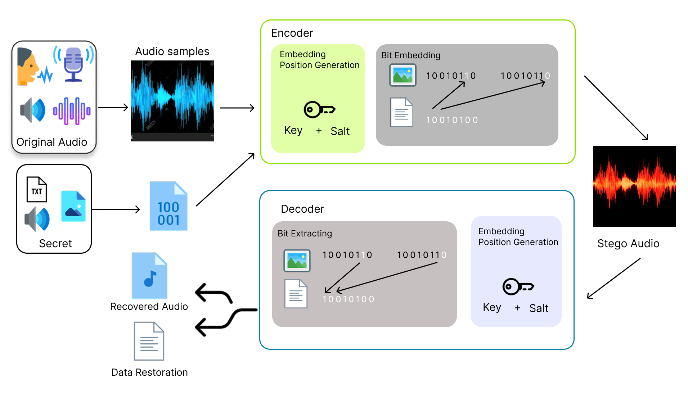

# Audio Steganography


## 1. Overview

This project implements a complete pipeline for Audio Steganography and Steganalysis. It features state-of-the-art algorithms like **Improved LSB** with content-based anchoring and includes tools for large-scale batch experimentation.




## 2. Key Features

| Algorithm | Type | Description | 
| :--- | :--- | :--- |
| **LSB-Based** | Spatial Domain | Replaces Least Significant Bits sequentially. | 
| **Phase Coding** | Frequency Domain | Embeds data into the phase spectrum (FFT). | 
| **Improved LSB** | Adaptive | Uses **Pseudo-Random Shuffling (PSR)** seeded by Password + Content Hash. |
### Highlights
Enhances standard LSB with a Key-Salt driven Pseudo-Random Number Generator, ensuring robust protection against sequential extraction attacks.

Conducts quantitative analysis involving signal fidelity metrics (SNR, PSNR) and detection resistance against ML classifiers.

Empirically identifies performance degradation (reduced SNR) of Phase Coding techniques in sparse, low-amplitude audio regions.

Features a complete workflow covering Preprocessing, Embedding, Transmission Simulation, and final Data Restoration.

## 3. Directory Structure

> **Note:** Large datasets in `inputs/` and generated files in `outputs/` are excluded from version control.
```text
D:.
│   main.py                 # [CLI] Main tool for single file encode/decode
│   README.md               # Project Documentation
│
├───AudioStego              # [CORE ALGORITHMS]
│   ├───improved_lsb        # PSR LSB (Secure & Robust)
│   ├───lsb                 # Standard LSB
│   ├───phasecoding         # Phase Coding
│   └───utils               # Visualization 
│
├───google_colab            # [LOGS] Experimental logs for Steganography & Steganalysis
│
├───inputs                  # [DATASETS]
│   ├───musdb-18            # Music Source (High Fidelity)
│   ├───random-image-coco   # COCO Image Dataset
│   ├───audio-cat-and-dogs  # Environmental Sounds
│   ├───timit               # Speech Corpus (Reference)
│   └───pascal-voc-2012     # Image Source (Reference)
│
├───outputs                 # [RESULTS]
│   ├───batch               # Bulk processing results
│   ├───encode              # Single encryption outputs
│   └───decode              # Extracted payloads
│
└───test                    # [EXPERIMENTS]
    ├───timit_voc.py        # Script: Large-scale embedding experiments
    └───outputs             # Experiment specific results
```
## 4. Data Preparation

To replicate the large-scale experiments, download the datasets and extract them into the `inputs/` directory.

**Recommended Datasets:**

1.  **[MUSDB18-HQ](https://zenodo.org/records/3338373)**
    * *Type:* High-fidelity music stems.
    * *Usage:* Ideal for testing high-capacity steganography on music files.

2.  **[COCO](https://www.kaggle.com/datasets/abhinav1609/random-images-image-steganography) & [Audio Cats/Dogs](https://www.kaggle.com/datasets/mmoreaux/audio-cats-and-dogs)**
    * *Type:* Large-scale image and environmental audio datasets.
    * *Usage:* Used for extended generalization tests.

**Reference Datasets (For Paper Replication):**

3.  **[TIMIT Acoustic-Phonetic Continuous Speech Corpus](https://www.kaggle.com/datasets/mfekadu/darpa-timit-acousticphonetic-continuous-speech)**
    * *Usage:* Used as the primary speech carrier in the reported experiments.

4.  **[Pascal VOC 2012](https://www.kaggle.com/datasets/banuprasadb/pascal-voc-2012) or 500 sample at [drive](https://drive.google.com/file/d/1DrLhIIbopS82gwrZlYcY7L3oTIXRDB58/view?usp=drive_link)**
    * *Usage:* Used as the standard image payload for capacity testing.

## 5. Installation

**Prerequisites:** Python 3.11 or higher is required.

1.  **Clone the repository:**
    ```bash
    git clone [https://github.com/nthai-cit/audio-steganograph.git](https://github.com/nthai-cit/audio-steganograph.git)
    cd audio-steganography
    ```

2.  **Install dependencies:**
    ```bash
    pip install -r requirements.txt
    ```

## 6. Usage Guide

**Encode (Hide Image with Password):**

```bash
python main.py encode -m improved -k 2 -p "MyPass" -i "inputs/song.wav" -s "inputs/img.jpg"
```
**Decode:**
```bash
python main.py decode -m improved -k 2 -p "MyPass" -i "outputs/encode/SESSION/stego.wav"
```

### 6.2. General Batch Processing

This mode allows users to automatically embed data into every audio file within a specific directory. It is ideal for testing datasets like MUSDB18.

**Preparation:**
1.  Download the **MUSDB18-HQ** dataset.
2.  Extract the audio files into the directory: `inputs/musdb-18`.

**Execution:**
Run the following command to embed a secret text file into all songs in the directory using the Improved LSB method:

```bash
python main.py batch -m improved -k 2 -p "MyPass" -i "inputs/musdb-18" -s "inputs/secret.txt" --visualize
```
### 6.3. Large-Scale Experimentation
**Standard Run (k=8 bits):**
```bash
python test/timit_voc.py -k 8
```
**Run and Save Audio Files: (Use this flag to preserve output wav files; otherwise, they are deleted automatically to conserve disk space.)**
```bash
python test/timit_voc.py -k 2 --save-audio
```
## 7. Command Line Arguments

| Argument | Short | Description | Default | Note |
| :--- | :--- | :--- | :--- | :--- |
| `encode`/`decode`/`batch` | N/A | Operation Mode | N/A | **Required** |
| `--method` | `-m` | Algorithm (`lsb`, `phase`, `improved`) | N/A | **Required** |
| `--input` | `-i` | Input Audio or Directory (batch) | GUI | Opens GUI if missing |
| `--secret` | `-s` | Secret File (Text/Image) | GUI | Required for Encode |
| `--password` | `-p` | Security Password | None | Used for `improved` only |
| `--k_bit` | `-k` | Number of bits to replace (1-8) | 2 | Used for `improved` only |
| `--visualize` | `-v` | Plot charts | False | Used for `batch`/`encode` |

---
